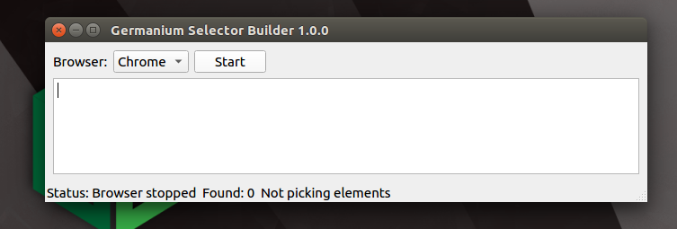
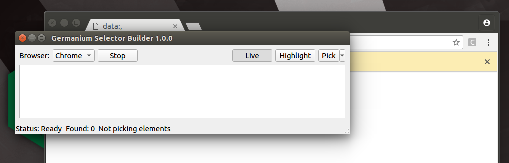
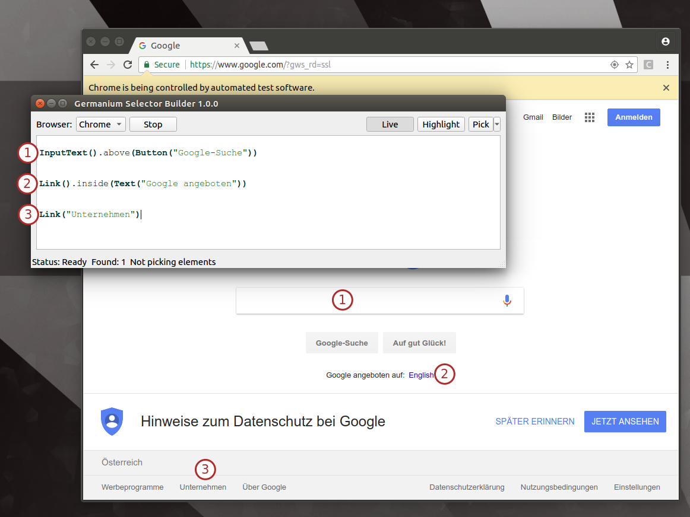

Germanium Selector Builder 1.0.0
================================

   logo

A simple yet powerful program to help you write Selenium selectors from
GermaniumHQ. Also supports Germanium selectors.

.. figure:: germaniumsb/doc/images/germanium-very-basic-usage.png
   :alt: Germanium Application Screenshot

   Germanium Application Screenshot

Introduction
------------

Selenium works with selectors to find the elements that the test will
interact with. For example to interact with the google search, after
opening the browser, to fetch the input element to type in a search
something like this is needed:

**Python Sample**

::

    wd.find_element_by_css_selector("input[name='q']")

**Java Sample**

::

    wd.findElement(By.css("input[name='q']"))

.. figure:: germaniumsb/doc/images/google-screenshot.png
   :alt: Google Screenshot

   Google Screenshot

In order to find such elements, usually it’s needed to inspect the
internal structure of the page using the developer tools. It’s the
responsibility of the test creator to then determine the correct ``CSS``
or ``XPath`` selector that will be used, to uniquely identify that
element.

This is a tedious and error prone task, since even simple misspelling
can cause a lot of wasted time in trying to figure out why the selector
isn’t matching the elements.

That’s why the Germanium Selector Builder (``GermaniumSB`` from here)
was written. In ``GermaniumSB`` you point your mouse to the element you
want a selector for, and you click it. The selector gets automatically
written.

.. figure:: germaniumsb/doc/images/germanium-very-basic-usage.png
   :alt: Germanium Application Screenshot

   Germanium Application Screenshot

Then the selector can be copied into the test.

Multiple selectors can be edited at the same time in the editor, in the
same way as in an SQL tool. The current selector can be evaluated using
the menu entry ``View`` > ``Highlight``, or its shortcut ``Ctrl+H`` when
the cursor is on the line of the selector.

Germanium selectors are also fully supported, and can also be edited and
troubleshooted with syntax highlight.

In the generation of the selectors, depending on which element is
selected, an ``XPath`` or a ``Css`` selector will be generated. The type
of the selector is reflected in the function name.

Usage
-----

When opening ``GermaniumSB`` a window opens that allows code editing. In
the code section is where the editing of the selectors, commenting them,
or highlighting them for troubleshooting will take place.

At the top there is a combo box that allows selecting the browser to be
used, and that browser can be started using the ``Start`` button from
the UI.

UI Buttons
~~~~~~~~~~

   Germanium Selector Builder Started

1. ``Start`` / ``Stop`` - allows stopping and starting the browser. The
   browser can be used as usual, only when picking elements the browsers
   clicks will be consumed by ``GermaniumSB`` in order to find the
   elements. After that the browser will resume its normal operation.

2. ``Live`` - can be toggled up and down to stop or start the polling of
   the browser;

   -  ``GermaniumSB`` polls every 2 seconds the status of the browser,
      and ensures that all the necessary scripts are injected correctly,
      and to retrieve the elements that the user picked. Because of that
      it might be possible on some browsers that the developer tools are
      unnaccessible, namely they will automatically close when opened.
      This is a problem of the browsers, not ``GermaniumSB``.
   -  In order to allow the user to use the developer tools of the
      browser - it the unfortunate case they close on polling, toggling
      the ``Live`` mode inactive will pause the polling in the browser.
      Both the browser and the application can still be used, but no
      selector picking, nor highlighting of elements is possible.

3. ``Highlight`` -when pressed will highlight the first element matching
   the selector where the cursor is, and will update the number of *all
   the elements that match the selector*. In case you have a flaky test
   it might happen because the selector is not specific enough, matches
   multiple elements and will get you in some runs the wrong element.

4. ``Pick`` - that allows picking an element, for which the selector
   will be generated, with up to 4 parent references.

   -  Parent references are what allows diferentiating selectors that
      otherwise would match too many elements. For example in a form
      that has many fields to fill in, we will want to select an input
      that corresponds to a specific label that’s in front of that
      input.
   -  For that in ``GermaniumSB`` we would pick ``Pick`` >
      ``+1 reference``, select first the input, then the parent
      reference we want this input to be related to, namely the label.
      The Elements section in the status bar will say how many elements
      are still needed for selection in order to generate the selector.

   Germanium Selector Builder - Browser Ready

UI Status Bar
~~~~~~~~~~~~~

In the bottom left corner of the application, in the status bar there
are three sections:

1. ``Status`` - The status of the application. This shows what’s the
   current state of the application. The available values are:

   1. Browser stopped - The browser needs to be started using the
      ``Start`` button.

   2. Browser starting - The browser is starting up.

   3. Loading monitoring - GermaniumSB is loading its support scripts in
      the browser.

   4. Ready - Browser is ready. You can use it normally, click around,
      type, and from GermaniumSB highlight selectors.

   5. Picking element - After you click the ``Pick`` button, you can
      click in the browser, to generate the selector for the clicked
      element.

   6. Paused - Script running in the browser is disabled, to allow the
      use of the developer tools.

   7. Computing selector - Germanium Selector Builder is computing the
      selector from the element.

   8. Error - Something bad happened.

2. ``Found`` - How many elements were found on the last highlight
   operation.

   -  Whenever in Selenium you’ll try to find an element, if there are
      multiple elements matching that selector, there is a chance you’ll
      get another element when the test runs. To address this problem,
      Germanium Selector Builder will show you how many other elements,
      including the one you see being highlighted, matched the selector.

3. ``Elements`` - How many elements should still be picked before a
   selector will be generated.

Germanium Selectors
-------------------

Beside generating Selenium selectors, Germanium Selector Builder allows
debugging Germanium selectors. All germanium selectors defined by the
Germanium API are available in the UI.

   Germanium Selectors

For example we could write the following selectors:

::

    Css("input[name='q']")                     # Selenium, using the pick
    InputText().above(Button("Google-Suche"))  # Germanium

    XPath("//div[string()='Google angeboten auf:  English  ']//a[string()='English']")
    Link().inside(Text("Google angeboten"))    # Germanium

    XPath("//a[string()='Unternehmen']")       # Selenium
    Link("Unternehmen")                        # Germanium

The *highlight selector* operation is available and works as expected.
Also, selectors can be multiline, including the positional filtering, or
DOM filtering like you can see in the 1st example in our list where we
just define an ``InputText().above(Button("Google-Suche"))``.
